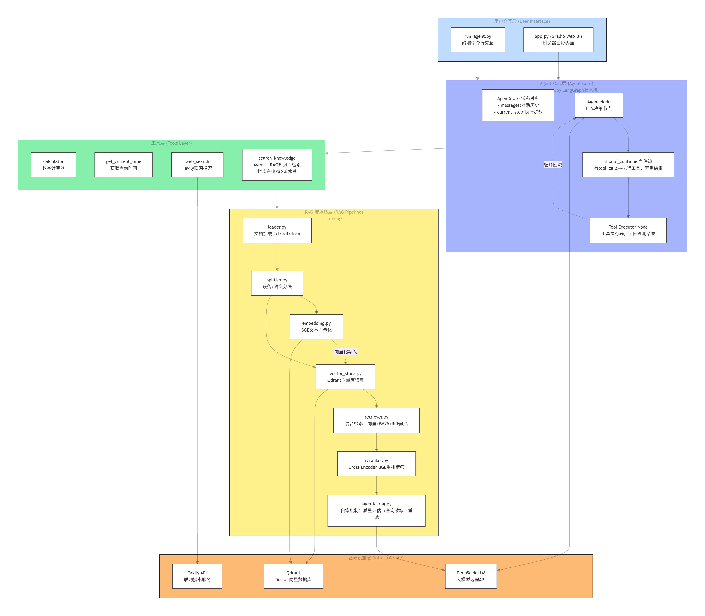
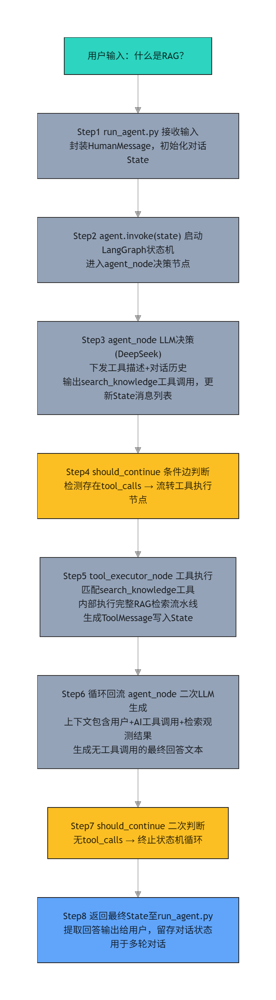
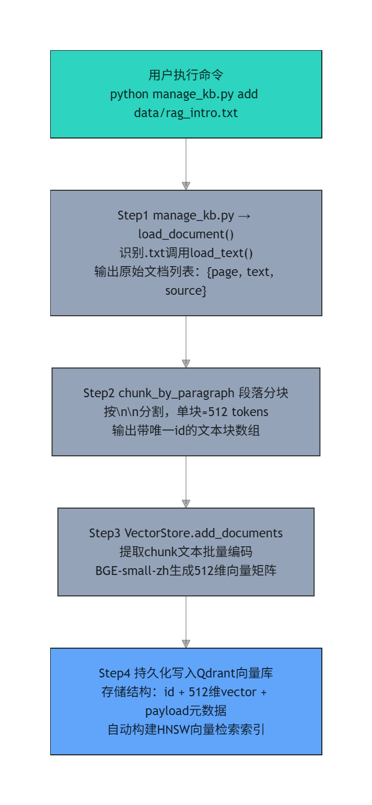
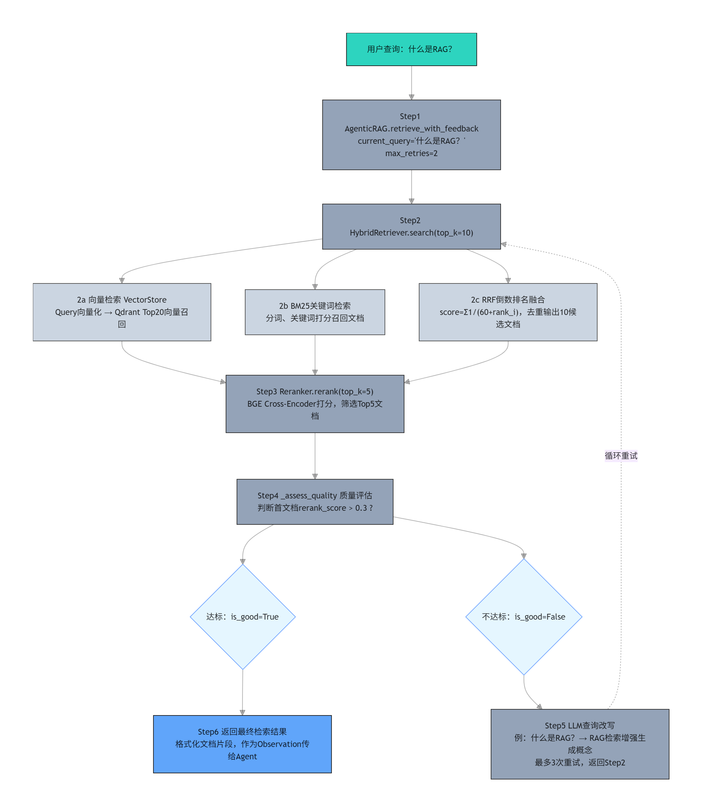

# 🧠 Research_Agent

基于 **LangGraph** 构建的智能研究助手 Agent，具备工具调用、RAG 知识检索、混合检索、重排序及 Agentic RAG 自愈能力。

> 📌 本项目是一个完整的 **AI Agent 应用开发学习与实践项目*
>
> ​      项目演示网址：https://modelscope.cn/studios/Stellan1103/research-agent

------


## ✨ 核心特性

| 特性                     | 说明                                                         |
| :----------------------- | :----------------------------------------------------------- |
| 🧠 **ReAct Agent**        | 基于 LangGraph 状态机，实现 "思考 → 行动 → 观察" 的自主决策闭环 |
| 🔧 **工具调用**           | 支持计算器、当前时间、互联网搜索、知识库检索等多种工具，Agent 自主选择调用 |
| 📚 **RAG 检索**           | 完整 RAG 流水线：文档加载 → 分块 → Embedding → 向量存储 → 检索 → 生成 |
| 🔀 **混合检索**           | 向量检索 + BM25 关键词检索 + RRF 融合排序，提升召回精度      |
| 🎯 **Cross-Encoder 重排** | 使用 BGE-Reranker 对候选文档精排，确保最相关内容排在前面     |
| 🔄 **Agentic RAG**        | 检索质量评估 + 自动查询改写 + 重试，让 Agent 自己判断并优化检索 |
| 🌐 **联网搜索**           | 集成 Tavily 搜索引擎，Agent 可获取实时信息                   |
| 📄 **多格式文档**         | 支持 `.txt`、`.pdf`、`.docx` 格式文档的解析与索引            |
| 🐳 **Docker 支持**        | 向量数据库 Qdrant 支持 Docker 一键启动，数据持久化           |


------

## 📁 项目结构

```
research_agent/
├── .env                     # 环境变量（API Key 等）
├── .gitignore               # Git 忽略文件
├── requirements.txt         # Python 依赖
├── ms_deploy.json           # ModelScope 部署配置
├── README.md                # 项目说明文档
│
├── run_agent.py             # 主入口：终端交互式 Agent
├── app.py                   # Web 界面入口（Gradio）
├── manage_kb.py             # 知识库管理脚本
│
├── test_*.py                # 测试脚本
│   ├── test_env.py          # 环境验证
│   ├── test_rag_full.py     # RAG 全流程测试
│   ├── test_agentic_rag.py  # Agentic RAG 测试
│   └── test_search.py       # 联网搜索测试
│
├── data/                    # 文档存放目录
│   └── *.txt, *.pdf, *.docx # 知识库文档
│
└── src/                     # 核心源码
    ├── graph.py             # LangGraph 状态机
    ├── tools.py             # Agent 工具定义
    └── rag/
        ├── loader.py        # 文档加载（txt/pdf/docx）
        ├── splitter.py      # 文档分块
        ├── embedding.py     # BGE Embedding
        ├── vector_store.py  # Qdrant 向量库
        ├── retriever.py     # 混合检索 + RRF 融合
        ├── reranker.py      # Cross-Encoder 重排
        ├── agentic_rag.py   # Agentic RAG 自愈机制
        └── rag_tool.py      # RAG 工具封装
```


## 🗂️ 依赖关系

```
run_agent.py
    │
    ├── from src.graph import create_agent
    │       │
    │       ├── from src.tools import TOOL_MAP, TOOLS
    │       │       ├── calculator
    │       │       ├── get_current_time
    │       │       ├── web_search
    │       │       └── (TOOL_MAP 自动生成)
    │       │
    │       ├── from src.rag.rag_tool import search_knowledge
    │       │       └── from src.rag.agentic_rag import AgenticRAG
    │       │               ├── from src.rag.retriever import HybridRetriever
    │       │               │       ├── from src.rag.vector_store import VectorStore
    │       │               │       │       └── from src.rag.embedding import encode_texts
    │       │               │       │               └── from sentence_transformers import SentenceTransformer
    │       │               │       │       └── from qdrant_client import QdrantClient
    │       │               │       └── from rank_bm25 import BM25Okapi
    │       │               └── from src.rag.reranker import Reranker
    │       │                       └── from transformers import AutoModelForSequenceClassification
    │       │
    │       └── from langgraph.graph import StateGraph, END
    │
    └── from langchain_core.messages import HumanMessage
```


## 🏗️ 技术架构



## 🔢 一次用户请求的完整数据传递流程




## 📚 知识入库流程




## 🔍 RAG 检索流程 (Agent 调用 search_knowledge 工具)




------

## 🚀 快速开始

### 前置条件

| 要求           | 说明                                     |
| :------------- | :--------------------------------------- |
| Python         | 3.11+                                    |
| Docker（可选） | 用于 Qdrant 向量数据库持久化             |
| API Key        | DeepSeek API（必填），Tavily API（可选） |

### 1. 克隆项目

bash

```
git clone https://github.com/你的用户名/research_agent.git
cd research_agent
```


### 2. 创建虚拟环境并安装依赖

bash

```
python -m venv .venv
source .venv/bin/activate        # Linux/Mac
# .venv\Scripts\activate         # Windows

pip install -r requirements.txt
```


### 3. 配置 API Key

创建 `.env` 文件（参考 `.env.example`）：

env

```
# DeepSeek API（必填，国内可直接访问）
DEEPSEEK_API_KEY=sk-你的DeepSeek密钥
DEEPSEEK_BASE_URL=https://api.deepseek.com

# Tavily Search API（可选，不填则使用模拟搜索）
TAVILY_API_KEY=tvly-你的Tavily密钥
```


### 4. 启动 Qdrant（可选，用于数据持久化）

bash

```
docker run -d -p 6333:6333 --name qdrant qdrant/qdrant
```


> 如果未安装 Docker，程序会自动切换到 **内存模式**，功能完全正常，只是重启后需重新导入文档。

### 5. 初始化知识库

将文档放入 `data/` 目录，然后执行：

bash

```
python manage_kb.py add data/你的文档.docx
# 或批量导入
python manage_kb.py add data/
```


### 6. 运行 Agent

bash

```
python run_agent.py
```


------

## ⌨ 使用示例

启动后，在终端输入问题，Agent 会自主决定如何回答：

text

```
👤 你: 请计算 25 * 4 + 18 等于多少？

🤔 [第 1 轮思考] Agent 正在分析...
   💡 决策：调用工具 → calculator
   🔧 执行工具：calculator({"expression": "25 * 4 + 18"})
   📋 观察结果：计算结果: 118

🤖 Agent: 25 * 4 + 18 的计算结果是 118。
```


text

```
👤 你: 什么是 RAG？它解决了什么问题？

🤔 [第 1 轮思考] Agent 正在分析...
   💡 决策：调用工具 → search_knowledge
   🔧 执行工具：search_knowledge({"query": "RAG 概念 解决的问题"})
   📋 观察结果：【片段 1】(来源: rag_intro.txt, 相关度: 0.78)
   RAG 全称 Retrieval-Augmented Generation...

🤖 Agent: RAG（检索增强生成）是一种...
```


text

```
👤 你: 今天有什么科技新闻？

🤔 [第 1 轮思考] Agent 正在分析...
   💡 决策：调用工具 → web_search
   🔧 执行工具：web_search({"query": "2026年 科技新闻"})
   📋 观察结果：【标题】AI Agent 迎来爆发式增长...

🤖 Agent: 根据最新新闻，...
```


------

## 🛠️ 知识库管理

使用 `manage_kb.py` 管理向量库中的文档：

bash

```
# 列出所有已入库的文档
python manage_kb.py list

# 添加单个文档
python manage_kb.py add data/文档.docx

# 删除指定文档
python manage_kb.py delete "文档名.docx"

# 添加整个目录下的文档
python manage_kb.py add data/
```


------

## 🔧 配置说明

### 模型配置

本项目默认使用 **DeepSeek API**，兼容 OpenAI 格式，国内可直接访问。

如需切换其他模型（如 OpenAI、通义千问等），修改 `src/graph.py` 中的 `ChatOpenAI` 配置即可。

### Embedding 模型

默认使用 `BAAI/bge-small-zh-v1.5`（轻量，约 100MB，适合开发和测试）。

如需更高精度，可在 `src/rag/embedding.py` 中切换为 `BAAI/bge-m3`（约 2.3GB，需良好网络）。

### 重排序模型

默认使用 `BAAI/bge-reranker-v2-m3`，首次运行时会自动下载（约 2.3GB）。

------

## 📊 技术选型说明

| 组件       | 选型         | 理由                                                         |
| :--------- | :----------- | :----------------------------------------------------------- |
| Agent 框架 | LangGraph    | 支持状态机、条件边、循环，比 LangChain Chain 更适合生产级 Agent |
| 向量数据库 | Qdrant       | 轻量、高性能、支持 Docker 一键启动，适合本地开发和部署       |
| Embedding  | BGE-small-zh | 中文优化，轻量（~100MB），效果与性能平衡                     |
| 重排序     | BGE-Reranker | Cross-Encoder 精排，显著提升检索精度                         |
| LLM        | DeepSeek     | 国内可直接访问，兼容 OpenAI 格式，性价比高                   |
| 搜索       | Tavily       | 专为 LLM 优化的搜索引擎，返回结构化摘要                      |

------

## 🤝 贡献

欢迎提交 Issue 和 Pull Request！

------

## 📄 许可

MIT License

------

**Happy Building ! **
